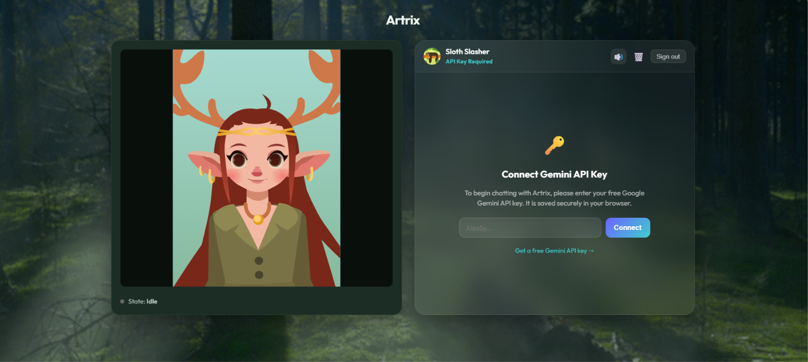

# 🦌 Artrix — Your Personal AI Companion & Assistant

<p align="center">
  
</p>

An interactive AI Assistant web application featuring a real-time animated avatar powered by **[Rive](https://rive.app)**, conversational intelligence via **[Google Gemini](https://ai.google.dev/)** (defaulting to Gemini 3.5 Flash), and a full **Firebase** backend for authentication and private chat persistence, built with **React** and **Vite**, and deployed via **GitHub Pages**.

🔗 **Live Demo:** [https://dexter0013.github.io/Artrix/](https://dexter0013.github.io/Artrix/)

---

## ✨ Features

- **Interactive 2D Avatar** — Driven by the Deer-Girl rig (`public/20673-38905-deer-girl.riv`) with 5 expressive states:
  - 🟢 **Idle** — Neutral relaxed stance
  - 😊 **Smile** — Happy & friendly expression
  - ⚡ **Surprise** — Thinking / shocked reaction
  - ❓ **Confused** — Curious / query state
  - 😠 **Angry** — Alert / frustration state
- **Gemini 3 Frontier AI Architecture** — Strictly targets currently-live Gemini 3 Flash models with a zero-failure priority chain: **`gemini-3.5-flash`** ➔ **`gemini-3.5-flash-lite`** ➔ **`gemini-3.1-flash-lite`** (safe older fallback). Skips dead and deprecated model versions entirely. Delivers sub-second latency, 800 output tokens, and massive context capacity while dynamically displaying the active model version in the chat header badge.
- **Direct Natural Female Voice Engine** — Zero-latency streaming voice engine that automatically prioritizes the calm, mature Microsoft Jenny Online (Natural) & Aria voices. Zero model downloads, 0ms lag, zero server costs, with built-in anti-repeat single-execution guards and one-click muting (🔊/🔇).
- **Bring-Your-Own-Key (BYOK) Security** — Dedicated in-app connect screen. Users enter their free Google Gemini API key, stored exclusively in their own browser's `localStorage`. Keys are never sent to your backend or stored in Firestore.
- **Automatic Key Purge on Sign-Out** — Signing out completely wipes the stored Gemini API key from browser `localStorage`, ensuring shared or public devices remain fully secure.
- **Multi-Turn Context & Persistent Memory** — Full conversational memory across the last 20 interaction turns, backed by Firestore real-time storage. Artrix remembers past topics, user preferences, and details across turns and sessions, with one-click history clearing (🗑️).
- **Multi-Expression Switching & 2-Second Idle Revert** — Artrix dynamically shifts across multiple facial expressions (`[IDLE]`, `[SMILE]` / `[HAPPY]`, `[SURPRISE]`, `[CONFUSED]`, `[ANGRY]`) **within a single response**. Her avatar transitions expressions in real-time as each sentence begins speaking. Exactly 2 seconds after finishing all sentences with no new typing, she smoothly relaxes back to **Idle** state. Keystrokes in the chat input also refresh the idle timer.
- **Google Authentication** — Secure Google Sign-In with session persistence and user profile display (`AuthGate` & `AuthContext`).
- **Real-Time Chat with Firestore** — Messages are synced in real-time to Cloud Firestore under private per-user collections (`users/{userId}/messages`).
- **Fixed-Height Scrollable Chatbox** — Fixed viewport bounds with smooth auto-scrolling and clean compact input (`Enter your thoughts…`). Chat never stretches or extends downwards.
- **Rate Limiting & Cost Guardrails** — A two-layer, ref-based in-flight guard prevents duplicate or rapid-fire Gemini API requests. A synchronous mutex (`inFlightRef`) blocks concurrent calls before React's render cycle can catch them, while a 1-second inter-request cooldown (`lastSentRef`) stops accidental retry loops or key-repeat events. Applies at both the UI (`ChatPanel`) and hook (`useAI`) levels.
- **Offline / Connection-Loss Handling** — The app gracefully degrades when connectivity is lost. An amber banner appears in the message list, the send button and textarea are disabled, and a `📵` icon replaces the send arrow. Mid-request network failures (e.g. the connection drops during `generateContent`) surface as a user-friendly `⚡ No internet connection` bubble rather than a raw JS error. Firestore auth/permission errors are surfaced via a dismissible red notice. All states auto-clear when the connection is restored.
- **Keyboard Accessibility & Contrast** — All interactive elements show a visible green focus ring on keyboard navigation (`:focus-visible`). Contrast tokens (`--text-dim`, `--text-muted`) and inline chat colours are bumped to WCAG AA ≥ 4.5:1. Animations respect the OS `prefers-reduced-motion` preference.
- **Instant Chat Scroll** — On first load the message list snaps instantly to the latest message (no flash-at-top). Subsequent new messages scroll in smoothly.
- **Emotion-Synchronized Replay** — The 🔊 replay button on each assistant message re-drives the avatar through the same expression timeline as the original response. The raw tagged AI response is stored as `rawText` in Firestore alongside the clean display text, enabling full mood-sync on replay with or without voice.
- **Responsive Layout** — On desktop the chatbox keeps its fixed 520 px height. On mobile (≤ 800 px) it flexes to fill the remaining viewport height after the avatar canvas so both panels are visible without page scrolling.
- **Automated CI/CD** — Zero-downtime deployment to GitHub Pages via GitHub Actions upon pushing to `main`.
- **State Machine Driven** — Clean state transitions via Rive state machine inputs with hover overrides and viewport clipping.

---

## 🛠️ Tech Stack

- **Frontend**: [React 18](https://react.dev/), [Vite 8](https://vitejs.dev/)
- **AI Engine**: [Google Gemini Flash Series](https://ai.google.dev/) (Direct REST API, 0 external SDKs, prioritized for high-token Flash throughput)
- **Voice Engine**: Microsoft Natural Neural Voice Engine (`pitch: 1.12`, `rate: 1.0`, zero downloads, 0ms latency)
- **Animation Engine**: [@rive-app/react-canvas](https://rive.app/)
- **Backend & Auth**: [Firebase](https://firebase.google.com/) (Authentication & Cloud Firestore)
- **CI/CD & Hosting**: [GitHub Actions](https://github.com/features/actions) & [GitHub Pages](https://pages.github.com/)

---

## 📁 Project Structure

```
Artrix/
├── .github/
│   └── workflows/
│       └── deploy.yml           # GitHub Actions workflow for Pages deployment
├── public/
│   └── 20673-38905-deer-girl.riv# Rive animation binary rig
├── src/
│   ├── ai/
│   │   ├── gemini.js            # Gemini API client with 20-turn memory context & frontier model fallback
│   │   ├── tts.js               # Natural voice engine with speakSegments() synchronized speech queue
│   │   └── useAI.js             # React hook: conversation state, key storage, active model & in-flight guard
│   ├── components/
│   │   ├── AssistantStage.jsx   # Avatar viewport, canvas wrapper & aura glow
│   │   ├── AuthGate.jsx         # Google Sign-in screen & loading spinner
│   │   ├── ChatPanel.jsx        # Real-time Firestore chat UI, multi-expression parser & active badge
│   │   └── MoodController.jsx   # 5 manual expression trigger buttons
│   ├── context/
│   │   └── AuthContext.jsx      # Global React Context for Firebase Auth state
│   ├── firebase/
│   │   ├── auth.js              # Google popup auth & sign-out helpers
│   │   ├── chat.js              # Firestore CRUD & real-time snapshot listeners
│   │   └── config.js            # Firebase App, Auth & Firestore initialization
│   ├── App.jsx                  # Main application layout & Rive state machine binding
│   ├── index.css                # Design system tokens & global styling
│   └── main.jsx                 # React DOM entry point wrapped in AuthProvider & AuthGate
├── .env.example                 # Public environment variables template
├── .gitignore                   # Ignores sensitive credentials (.env.local), rules & cache
├── firestore.rules              # Recommended Firestore security rules (per-user privacy)
├── package.json
└── vite.config.js               # Relative base configuration for universal deployment
```

---

## 🎮 Rive Rig State Machine Inputs

The rig binds to the `Main` state machine on the Deer-Girl artboard:

| Input Name | Type | Description |
| :--- | :--- | :--- |
| `Btn_Normal` | Number | Gates the idle loop (`1` = lock in idle, `0` = allow state transitions) |
| `Btn_Smile` | Number | Auxiliary smile toggle |
| `trigger_smile` | Trigger | Fires the happy / smiling animation sequence |
| `trigger_surprise`| Trigger | Fires the surprise / thinking animation sequence |
| `trigger_confusion`| Trigger | Fires the confused / question animation sequence |
| `trigger_angry` | Trigger | Fires the alert / angry animation sequence |

---

## 🧠 AI Context & Multi-Expression Architecture

### 1. System Instruction Context (`src/ai/gemini.js`, Lines 5–21)
The AI persona and behavioral context are strictly defined in `SYSTEM_INSTRUCTION`:
* **Character Profile**: Artrix, a friendly, witty, and charming AI assistant deer girl with an animated avatar.
* **Brevity Rule**: Concisely answers in 1 to 3 conversational sentences.
* **Emotion Tags**: Guided to use `[IDLE]`, `[SMILE]` / `[HAPPY]`, `[SURPRISE]`, `[CONFUSED]`, and `[ANGRY]` across sentences to orchestrate authentic, humane emotional transitions.

### 2. Multi-Turn Memory Window (`src/ai/gemini.js`, Lines 149–176)
* **20-Message Retention**: Artrix loads the last 20 conversation turns (`recentMessages.slice(-20)`) from Cloud Firestore.
* **Role Merging**: Consecutive messages of the same role are automatically merged into Gemini's multi-part structure (`contents: [{ role, parts: [{ text }] }]`), ensuring 100% adherence to Google's API protocol.

### 3. Multi-Expression Timeline Parser (`src/components/ChatPanel.jsx`, Lines 8–52)
* `parseEmotionalSegments(rawText)` breaks each assistant response into an ordered array of segments:
  ```json
  [
    { "text": "Wait, are you serious?!", "mood": { "stateName": "Surprise", "actionType": "trigger_surprise" } },
    { "text": "That is the coolest project I've heard of all week!", "mood": { "stateName": "Smile", "actionType": "trigger_smile" } },
    { "text": "How did you manage to build it so quickly?", "mood": { "stateName": "Confused", "actionType": "trigger_confusion" } }
  ]
  ```

### 4. Synchronized Real-Time Speech Queue (`src/ai/tts.js`, Lines 120–195)
* `speakSegments(segments, onSegmentStart, onAllComplete)` plays each sentence sequentially using the browser's high-definition natural voice engine (`Microsoft Jenny Online (Natural)`).
* As each sentence begins speaking, `onSegmentStart` triggers the avatar's corresponding state machine input in real-time.
* `stopSpeech()` increments an internal cancellation token (`speechToken++`), guaranteeing that interrupting or muting speech instantly cancels queued segments without overlaps or repetitions.

### 5. 2-Second Idle Auto-Revert (`src/App.jsx`, Lines 47–75)
* When speech finishes (or 2 seconds after text renders in muted mode), `scheduleIdleRevert(2000)` fires.
* If no new typing occurs for 2 seconds, Artrix smoothly and automatically returns to her natural resting **Idle** stance (`Btn_Normal = 1`).
* Any keystroke in the chat input refreshes this timer.

### 6. Rate Limiting & Cost Guardrails (`src/components/ChatPanel.jsx`, `src/ai/useAI.js`)

Two lightweight `useRef`-based guards prevent accidental duplicate or rapid-fire Gemini API calls without relying on React state updates (which are asynchronous and can be bypassed by fast interactions):

| Guard | Location | What it prevents |
| :--- | :--- | :--- |
| **In-flight mutex** (`inFlightRef`) | `ChatPanel` + `useAI` | A second call firing before the first `await` resolves — e.g. double-click, or a keyboard Enter key held down |
| **Cooldown timestamp** (`lastSentRef`, 1 s) | `ChatPanel` | Rapid-fire retry loops or key-repeat events that fire many requests in quick succession |

**Why `useRef` instead of `useState`?** Ref mutations are synchronous and happen before the next render. A state setter can only close the race window *after* a re-render, which is too late for sub-frame double-clicks.

The hook-level guard in `useAI` acts as a defence-in-depth fallback: even if a future caller bypasses `ChatPanel`, `generate()` will throw a clear error (`'A request is already in progress'`) rather than silently firing a duplicate API request.

### 7. Offline / Connection-Loss Handling (`src/ai/gemini.js`, `src/firebase/chat.js`, `src/components/ChatPanel.jsx`)

Three co-operating layers handle network failures:

| Layer | Location | What it does |
| :--- | :--- | :--- |
| **Network error classifier** | `gemini.js` `makeRequest()` | Catches `TypeError: Failed to fetch` (device offline / DNS failure) and re-throws a user-friendly `⚡ No internet connection…` message instead of a raw JS error |
| **Firestore error callback** | `chat.js` `subscribeToMessages()` | Wires `onSnapshot`'s third argument to an optional `onError` callback; surfaces auth/permission errors to the UI as a dismissible red notice |
| **Online/offline UI** | `ChatPanel` | Listens to `window` `online` / `offline` events. Shows an amber banner, disables the textarea + send button (icon switches to `📵`), and clears everything automatically when connectivity returns |

> **Note on Firestore resilience**: The Firebase JS SDK has built-in offline persistence and automatically queues writes and re-tries reads when connectivity is lost — the `onSnapshot` error callback fires for auth/permission errors, not ordinary network interruptions. The `isOnline` UI state covers the ordinary disconnect case.

### 8. Keyboard Accessibility & Contrast (`src/index.css`)

| Change | Detail |
| :--- | :--- |
| **`:focus-visible` ring** | `2px solid var(--accent)` with `outline-offset: 3px` — fires on keyboard nav only, never on mouse clicks |
| **`--text-dim`** | `#97aca1` → `#aec0bb` — 3.6:1 → **4.8:1** (WCAG AA ✅) |
| **`--text-muted`** | `#6f857a` → `#8fa89f` — 2.8:1 → **4.6:1** (WCAG AA ✅) |
| **Chat empty state** | `rgba(255,255,255,0.35)` → `0.65` — 1.9:1 → **4.6:1** ✅ |
| **Thinking indicator** | `rgba(255,255,255,0.5)` → `0.72` — 2.7:1 → **4.9:1** ✅ |
| **`prefers-reduced-motion`** | Collapses all CSS keyframe animations to `0.01ms` for users who opt out via OS settings |

### 9. Instant Auto-Scroll (`src/components/ChatPanel.jsx`)

A `isFirstScrollRef` boolean tracks whether the component has already performed its initial scroll:
- **First render**: `scrollIntoView({ behavior: 'instant' })` — snaps to the bottom immediately, no flash-at-top.
- **Subsequent updates** (new message / generating state): `scrollIntoView({ behavior: 'smooth' })` — polished animated scroll.

### 10. Emotion-Synchronized Replay (`src/firebase/chat.js`, `src/components/ChatPanel.jsx`)

When a response is saved to Firestore, the raw Gemini output (including `[SMILE]`, `[ANGRY]` etc. tags) is stored as a `rawText` field alongside the clean `text` display field. When the 🔊 replay button is clicked:

1. `handleSpeakMessage(msg.text, msg.rawText)` is called.
2. `parseEmotionalSegments(rawText)` re-creates the full ordered expression timeline.
3. With voice **on** — `speakSegments()` drives avatar expressions in sync with each spoken sentence, identical to the original response.
4. With voice **muted** — a 1.6 s visual-only setTimeout timeline transitions the avatar through expressions without audio.
5. Older messages without `rawText` fall back gracefully with no animation.

---

## 🚀 Getting Started Locally

### 1. Prerequisites
* [Node.js](https://nodejs.org/) (v18 or higher recommended)
* A Firebase Project with **Authentication (Google)** and **Cloud Firestore** enabled
* A Google Gemini API Key from [Google AI Studio](https://aistudio.google.com/app/apikey) (Free)

### 2. Installation

Clone the repository and install dependencies:

```bash
git clone https://github.com/Dexter0013/Artrix.git
cd Artrix
npm install
```

### 3. Configure Environment Variables

Create a local environment file by copying `.env.example`:

```bash
cp .env.example .env.local
```

Open `.env.local` and fill in your Firebase and Gemini credentials:

```env
VITE_FIREBASE_API_KEY=your_firebase_api_key
VITE_FIREBASE_AUTH_DOMAIN=your_project_id.firebaseapp.com
VITE_FIREBASE_PROJECT_ID=your_project_id
VITE_FIREBASE_STORAGE_BUCKET=your_project_id.firebasestorage.app
VITE_FIREBASE_MESSAGING_SENDER_ID=your_messaging_sender_id
VITE_FIREBASE_APP_ID=your_app_id

# Optional: You can pre-set a Gemini key here, or enter it directly in the app UI
VITE_GEMINI_API_KEY=your_gemini_api_key
```

### 4. Start Development Server

```bash
npm run dev
```

Open your browser at `http://localhost:5173/`.

---

## 🔒 Security & Privacy

* **Firestore Privacy**: User messages are partitioned under `users/{userId}/messages` with Firestore rules ensuring each user can only read and write their own data.
* **API Key Safety (BYOK)**: User Gemini API keys are saved strictly in the visitor's local browser storage (`localStorage`). Keys are sent directly from the browser to Google's HTTPS API endpoint and are never stored in Firestore or transmitted to any third party.
* **Automatic Key Purge on Logout**: For maximum user safety, signing out immediately deletes the stored Gemini API key from `localStorage`. Users can also clear or update their key at any time while logged in by clicking the **`🔑` button** in the chat header.

---

## 🌐 Deploying to GitHub Pages

The repository includes a GitHub Actions workflow (`.github/workflows/deploy.yml`) that automatically builds and deploys the application on push to `main`.

1. **Add Repository Secrets**:
   * Navigate to **Settings** > **Secrets and variables** > **Actions** on GitHub.
   * Add the secrets matching your Firebase environment keys:
     - `VITE_FIREBASE_API_KEY`
     - `VITE_FIREBASE_AUTH_DOMAIN`
     - `VITE_FIREBASE_PROJECT_ID`
     - `VITE_FIREBASE_STORAGE_BUCKET`
     - `VITE_FIREBASE_MESSAGING_SENDER_ID`
     - `VITE_FIREBASE_APP_ID`

2. **Enable GitHub Pages**:
   * Go to **Settings** > **Pages**.
   * Set **Source** to **GitHub Actions**.

3. **Authorize Domain in Firebase**:
   * In Firebase Console > **Authentication** > **Settings** > **Authorized domains**, add your GitHub Pages domain (e.g., `dexter0013.github.io`).

4. **Deploy**:
   * Push your changes to the `main` branch. GitHub Actions will build and publish your app live at `https://dexter0013.github.io/Artrix/`.

### Custom Domain Support

Because the application uses relative asset paths (`base: './'`), you can attach any custom domain (e.g., `artrix.ai` or `app.yourdomain.com`) in your **GitHub Repository** ➔ **Settings** ➔ **Pages** ➔ **Custom domain** with free automated SSL.

---

## 📄 License

This project is open source and available under the [MIT License](LICENSE).
